# Make a Simple Raspberry Pi Weather Dashboard Using IBM Cloud


### Navigate to this repo: https://bit.ly/2rOwaGK

## Introduction 
Node-RED is a wonderful tool that is used for prototyping and interacting with IoT devices, like the Raspberry Pi. It is a tool that is very easy to get started with and is a great for beginners who want to write and understand programming flow.

**In this lab we will be using Node-RED on IBM Cloud to build a temperature and humidity dashboard.** We will receIve temperature and humidity data from a Raspberry-Pi Sense hat and then use this data to create a dynamic real time dashboard that provides information about humidity and temprature metrics that the SenseHat provides. 

### In this workshop you will learn :

**(1)** The fundamentals of Node-RED and IBM Cloud 

<details><summary><strong>Learn More</strong></summary>

[Node-RED](https://nodered.org/) is a visual tool for wiring the Internet of Things. It is easy to connect devices, data and API’s (services). It can also be used for other types of applications to quickly assemble flows of services.

Node-RED is available as open source and has been implemented bythe IBM Emerging Technology organization. Node-RED provides a browser-based flow editor that makes it easy to wire together flows using the wide range of nodes in the palette. Flows can be then deployed to the runtime in a single-click. While Node-Red is based on Node.js, JavaScript functions can be created within the editor using a rich text editor. A built-in library allows you to save useful functions, templates or flows for re-use.

Node-RED is included in the Node-RED starter application in [IBM Cloud](https://www.ibm.com/cloud) but you can also deploy it as a stand alone Node.js application. Node-RED can not only be used for IoT applications, but it is a generic event-processing engine. For example, you can use it to listen to events from http, websockets, tcp, Twitter and more and store this data in databases without having to program much if at all. You can also use it for example to implement simple REST APIs. You can find many other sample flows on the [Node-RED website](https://flows.nodered.org/).

</details>
 
**(2)** The fundamentals of working with the Raspberry-Pi Sense Hat 
<details><summary><strong>Learn More</strong></summary>
 
 The [Raspberry Pi](https://www.raspberrypi.org/) is a low cost, credit-card sized computer that plugs into a computer monitor or TV, and uses a standard keyboard and mouse. It is a capable little device that enables people of all ages to explore computing, and to learn how to program in languages like Scratch and Python. It’s capable of doing everything you’d expect a desktop computer to do, from browsing the internet and playing high-definition video, to making spreadsheets, word-processing, and playing games.

 In this lab we will be working with the Raspberry Pi as well as an accessory called the [Sense HAT Cape](https://projects.raspberrypi.org/en/projects/getting-started-with-the-sense-hat/3)

 The Sense HAT is an add-on board for the Raspberry Pi, made especially for the Astro Pi competition. The board allows you to make measurements of temperature, humidity, pressure, and orientation, and to output information using its built-in LED matrix.

 In this lab we will be using the Rasberry Pi and the Sense HAT to capture data on Temperature and Humidity which will then be displayed on a dashboard built on Node-RED on the IBM Cloud 
 
</details>

## Prerequisite : Create IBM Cloud Account 

In order to complete this workshop you will need to create an IBM Cloud account.  

1. [Sign up for an account here](https://ibm.biz/BdqFbD)


2. Verify your account by clicking on the link in the email sent to you


## Hardware Setup : 

The Raspberry Pi with the Sense HAT allows you to make measurements of temperature, humidity, pressure, and orientation, and to output information using its built-in LED matrix. We will use it to publish Temperature(Centigrade) and Humidity metrics to [Node-RED](https://nodered.org/) on the [IBM Cloud](https://ibm.biz/BdqFbD) - free account! It will also display the Temperature(Centigrade) to the matrix screen everytime your `cron` job runs

### Step 1 : 
* Setting up Raspbian on your Pi is easiest with [NOOBS](https://www.raspberrypi.org/documentation/installation/noobs.md)

### Step 2 : 
* setting up [Sense HAT](https://projects.raspberrypi.org/en/projects/getting-started-with-the-sense-hat)

### Step 3 : 
*  Open or ssh into your pi, then setup a cron job as root on Raspberry Pi with a SenseHat
```sh
#become root user
sudo su
touch /home/pi/sense.log
crontab -e
# add the following line to POST updates every 5 or any interval you like, I chose 5 minutes
echo "5 * * * * /usr/bin/python /home/pi/dev/pi-hat-node-red/push.py >> /home/pi/sense.log 2>&1"
# restart cron
systemctl restart cron

exit
#revert to pi user
mkdir -p /home/pi/dev && cd /home/pi/dev

#clone repo
git clone https://github.com/IBMDeveloperNYC/Pi-Sense-HAT-Node-RED
cd Pi-Sense-HAT-Node-RED
ls
stat push.py
echo "push.py should be here"
```

## Node-RED Setup 
Once your hardware is set up , the next thing we are going to do is set up Node-RED on IBM Cloud. We will then use the Node-RED editor to create a flow to read the data coming from the Raspberry-Pi and the Sense HAT and display the data on a dashboard that looks like so : 

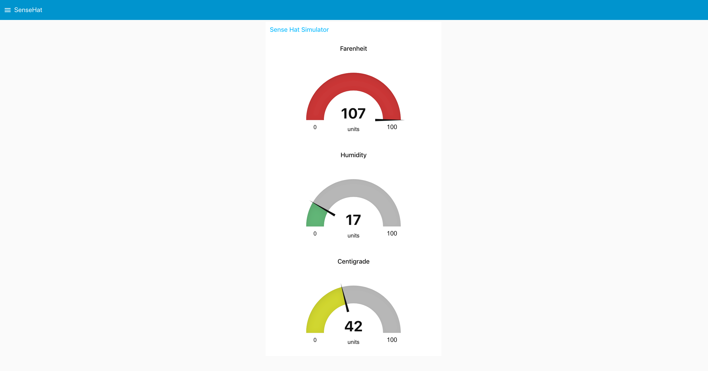


### STEP 1 : Run Node-RED using IBM Cloud 
1. Log in to your [IBM Cloud account](https://ibm.biz/BdqFbD)
2. Click on "Catalog" at the top-right corner
3. Search and select "Node-RED Starter" 
4. Give  name to your app and click "Create" --> **We Suggest** 
`<<lowercase_firstinitial>><<lowercase_lastinitial>>nodered`
```For example : 
   User Name - James Bond 
   Node-RED App Name  - jbnodered
```
5. Once your app is created you'll be able to access it through the [resource list](https://cloud.ibm.com/resources)

Click the 'Visit App URL' option to access your Node-RED instance in your browser. (click next for the steps displayed until you see the option 'Go to your Node-Red Flow Editor', and select "Not recommended: Allow anyone to access the editor and make changes" for the second step. 


### STEP 2 : Working with the http input node 
 In the left navigation pane of the Editor you will see a lot of standard Node-RED nodes. 

 1. From the input category of nodes drag the `http` node and drop it on the editor pane.
> Single clicking on a dragged node lets you see the info for the node on the 'Info' tab on the right navigation pane. 
> Double clicking on the node lets you edit the node's properties. 
2. Double click on the http node to edit it's properties 
 * Set Method to Post 
 * Set url endpoint to `/sense-hat` 
 * Set name to `Sense-HAT POST` 

You should have this : 
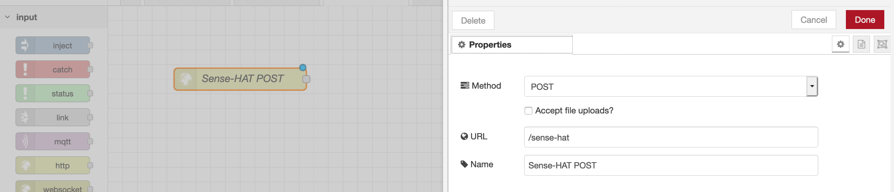


### STEP 3: Connect http input to http output
1. From the output category of nodes , drag the `http-response` node into the editor. 
2. Drag a connection from the http input node and connect it with the http output node 
3. Double click on the output node and set: 
 * Status Code -> 200 
 * Add headers by clicking on the `+ add` button on the bottom 
 * Name the header key : `done` and header value : `OK-MRB` 
 4. You can also drag a debug node and connect it to the output of the input node to see the response once we connect the url to the raspberry pi 
 > Double click on debug node and set output to `complete msg object`

 You should have this : 
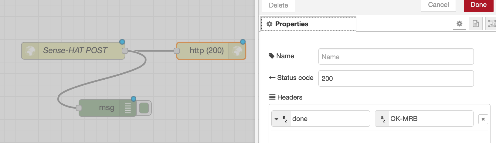

Basically what we are trying to do here is create a connection for the Raspberry Pi to send messages to. The way we can do this is by creating a POST request 

To test if the Raspberry Pi is successfully able to recieve messages from the PI : 

Take the url for your NodeRED instance and append the `/sense-hat` 

You should have something like this : 
```
https://<<lowercase_firstinitial>><<lowercase_lastinitial>>nodered.mybluemix.net/sense-hat
```
> <<yourNodeRedSubDomainname>> is the name you gave your Node-RED instance. It can be found in the url of your Node-RED editor 

This is the url that we will then add to the `push.py` code which is used to capture the temperature and humidity data from the Sense HAT 

Once successfully connected you should be able to see the temperature and humidity in the debug panel. 

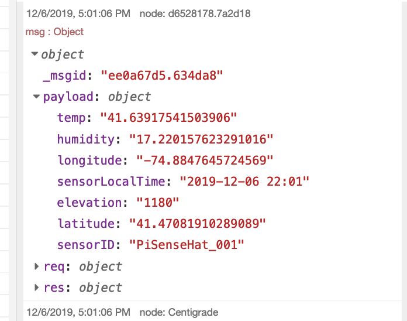

Congrats if you are able to see data in your debug panel! You can now move on to building a dashboard from this data! 

### * If you can not see data coming in from PI you can build a DATA Simulator *

1.  From the input category of nodes drag the `input` node and drop it on the editor pane.
2. Double click on the input node to edit it's properties 
* Set Payload to JSON 
* Copy JSON from [tempData.json](./tempData.json) and paste it into JSON input 
> this will act as the JSON temperature and humidity data coming from the pi 
* Name node `Sense-HAT Simulator` 
3. Connect the `Sense-HAT Simulator` node to debug node and deploy 
> Double click on debug node and set output to `complete msg object`

Now when you click on the inject button you should see the data that the sense hat would simulate. 

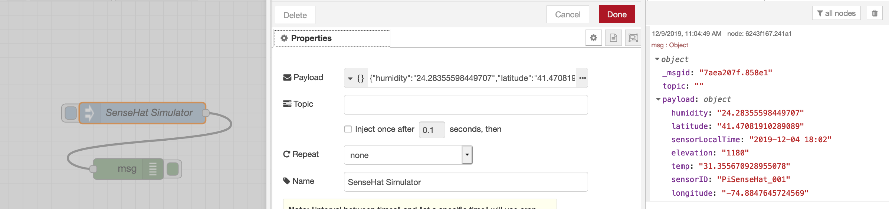

Congrats!You can now move on to building a dashboard from this data!


### STEP 4: Building the Temparature and Humidity Function 
In this step we will have to do some math to convert the temperature and humidity coming from the PI to Farenheit and Celcius. The output from this function will include : 
* Humidity 
* Temperature - Farenheit 
* Temperature - Celcuius 

1. From the function category of nodes , drag the function node into the pannel. 
2. Double click on the function node and add the following code : 
``` 
if( msg.payload === false ) {
    return null;
}
    
var msg1 = {};
var msg2 = {};
var msg3 = {};

msg1.payload = Math.round(msg.payload.temp*1.00);
msg1.topic = "Centigrade";
msg2.payload = Math.round(((msg.payload.temp*1.00) * 9/5) + 32);
msg2.topic = "Farenheit";
msg3.payload = Math.round(msg.payload.humidity*1.00);
msg3.topic = "Humidity";

return [msg1, msg2, msg3];

```
> This code is outputing 3 messages from 3 variables `msg1` = Celcius , `msg2` = Farenheit , `msg3` = Humidity 
3. Make sure the output of the function is 3 since the code is outputting 3 values that we will use to build our dashboard  
4. Name the function `temp and humidity preparation`

Your function properties should look like this : 
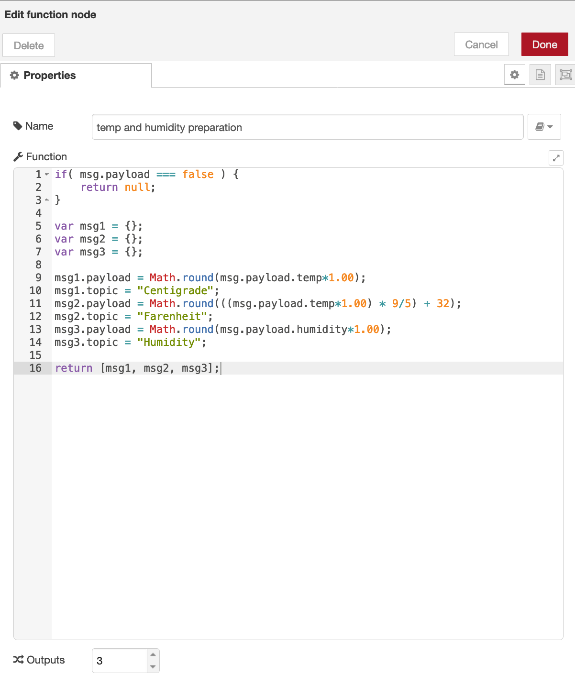

5. Once you have the function node setup you will want to connect it's outputs to debug nodes. 
* Drag 3 Debug nodes to the editor and connect the nodes to the output of the function 
* Name the Debugs as Centigrade , Farenfeit and Humidity 
> 3 function variables : `msg1` = Celcius , `msg2` = Farenheit , `msg3` = Humidity 
You should have something that looks like this : 


### Step 5 : Adding Function Inputs 
Your input to the function node will depend on wheather you connect to the **POST request nodes** that connect to the Raspberry Pi and Sense Hat or if you connect to the **Sense-HAT Simulator node** your 

**Connecting to POST request nodes** 
> This method assumes that you will send your Node-RED url and endpoint to the push.py code to recieve live updates from the Raspberry Pi and Sense Hat 
*  Connect the output of the http input node named `sense-hat POST` to the input of the function node 
You should see something like : 
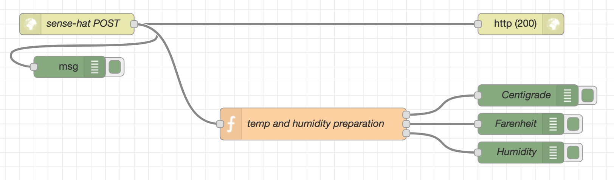

Now on your debug pannel you should see the Farenheit , Centigrade and Humidity that is coming in live from the Raspberry-PI and Sense-HAT 
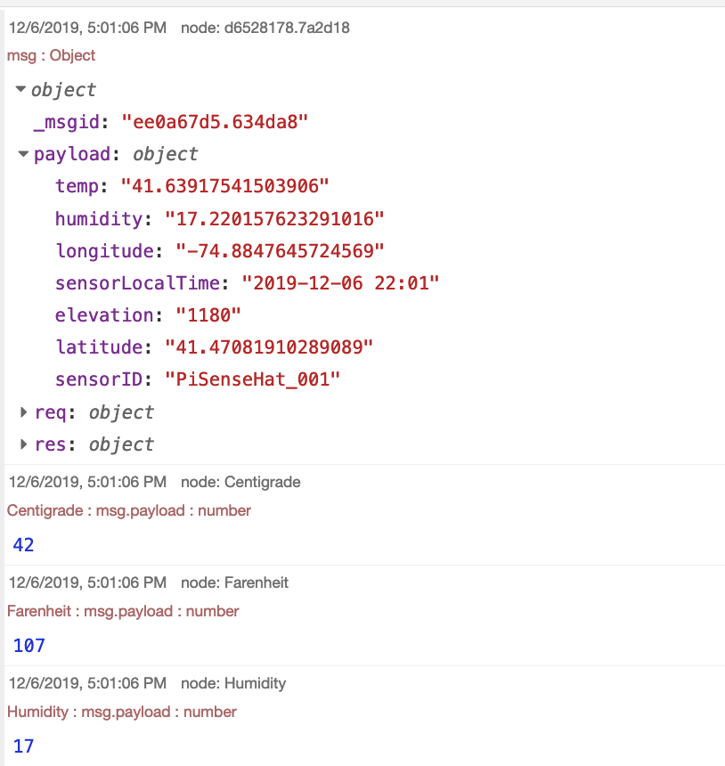

Congrats! You are seeing real-live temerature and humidty data coming into the cloud from IoT device! 

**Connecting to the Sense-HAT Simulator node** 
> This method assumes that you will be using an input node with sample JSON to simulate the IoT Device 
* Connect the output of the inject input node named `SenseHat Simulator` to the input of the function node 

Your flow should look like this. Once you deploy, you can inject the value from the input node. You should be able to see  the Farenheit , Centigrade and Humidity that is simulated in your debug panel 
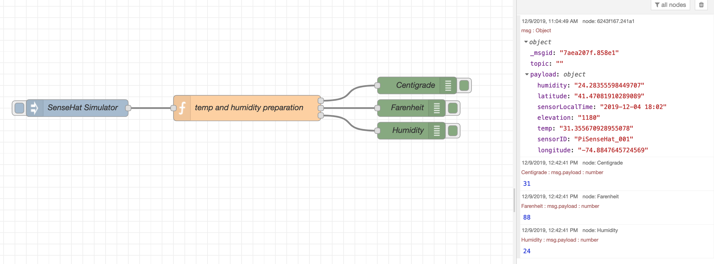

Congrats! You are seeing temerature and humidty data that is simulated from an IoT device! Feel free to change values on of humidity and temperature in the [tempData.json](./tempData.json) input to see how the function converts temperature to Celcius and Farienheit. 

### Step 6 : Creating Dashboard 
If you don't have dashboard nodes you will need to install them. 
To do so go to: 
* The hamburger menu on the top right hand side of your node-RED editor. 
* Go to Manage Palette 
* Go to Install Tab and search for `node-red-dashboard` 
* Press install and shortly you will see dashboard nodes in your right hand node palette 

*Steps to Create a Dashboard*  
1. From the dashboard category of nodes , drag three guage nodes into the pannel. 
2. Connect each guage node to the three outputs of the function nodes
> Similar to the debug nodes in the previous stes 
3. Edit Guage Nodes : 
* Double click on the properties of 1 of the Guage Nodes 
* Edit Group by clicking on the pencil icon 
    * Give a Name  such as `Sense Hat Simulator` 
    * Give a Tab name by clicking on pencil next to Tab Value . I called mine `SenseHAT-Dashboard` 
    * Click Update and you should see : 
     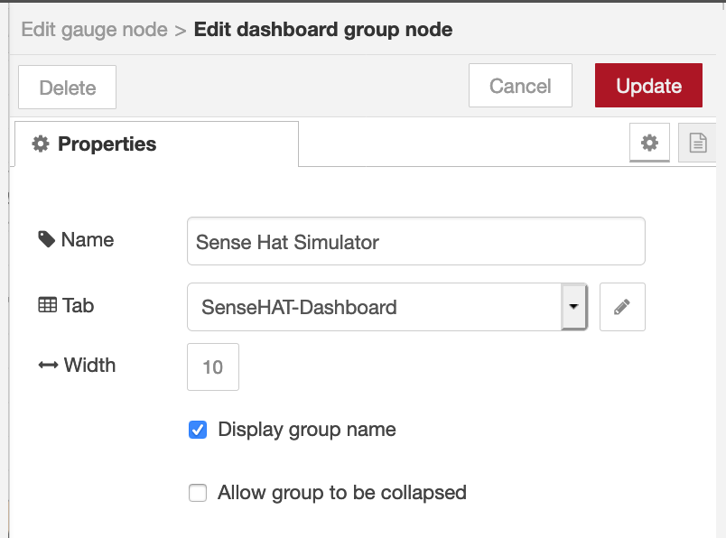
> This will be the Dashboard Name that will be used across all guage nodes in this flow 
4. Give the Guage a lable such as : `Centigrade` 
5. Give the Guage a value range : `0 to 100` 
6. Repeate these steps for the two other Guage Nodes , except give the other two guages `Farenheit` and `Humidity` labels 

You should see something like this : 
**POST Node Connection Flow** 
   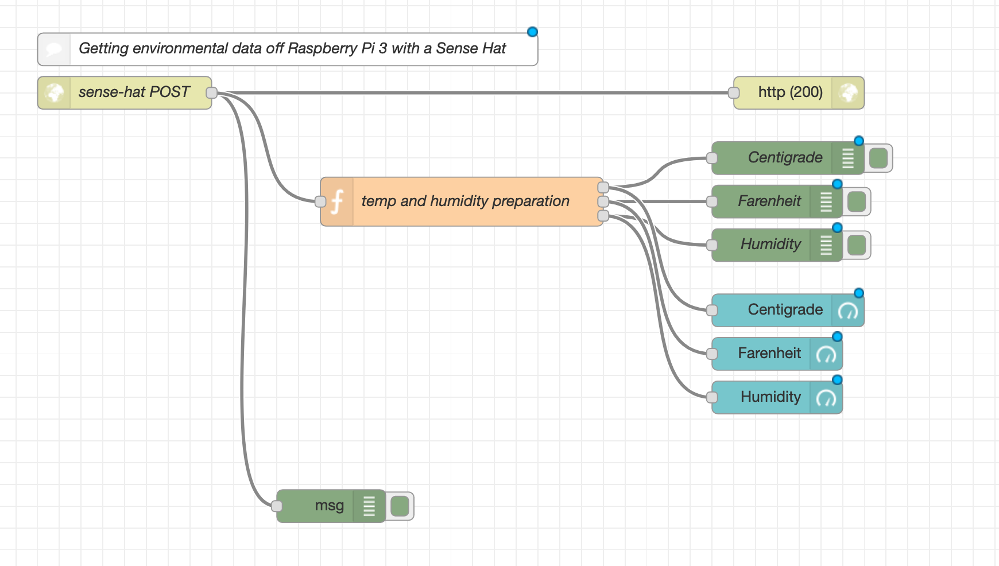

**Simulator Connection Flow** 
    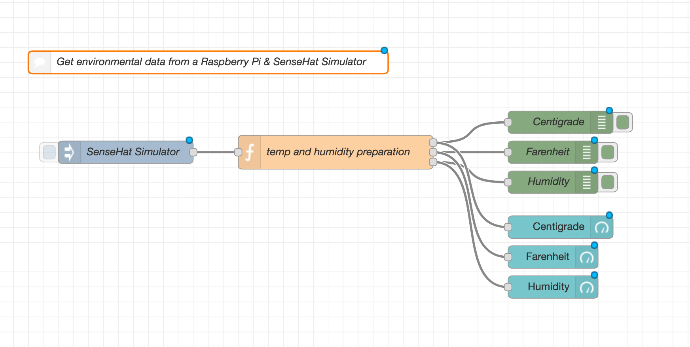


Now if you go to the Dashboard tab on the right hand side next to the debug and info tabs you should be able to launch your dashboard. Click on the little square with arrow in the right most corner to see Dashboard! 
    


## Congratulations for completing this Lab! 
Congrats for completing this lab. By the end of this lab you should be able to see how you can tie in Hardware IoT device such as a Sense-HAT Cape with a Raspberry Pi to send temperature and humidity data to Node-RED on the IBM Cloud 

If you ever get stuck on any of these steps go ahead an import any of these solutions into your Node-RED editor. 

*To Import* 
Go to > Hamburger Menu > Imort > Clipboard 

You can copy the JSON contents of either of these flows to see how the solutions were created in the steps above! 

* [POST request Sense-HAT Flow](./SenseHat-flow.json)
* [Sense-HAT Simulator Flow](./SenseHAT-Simulator-flow.json)


### Appendix/Figures/Images


***Figure 1: Node-RED Guages indicate it's Cold indoors***

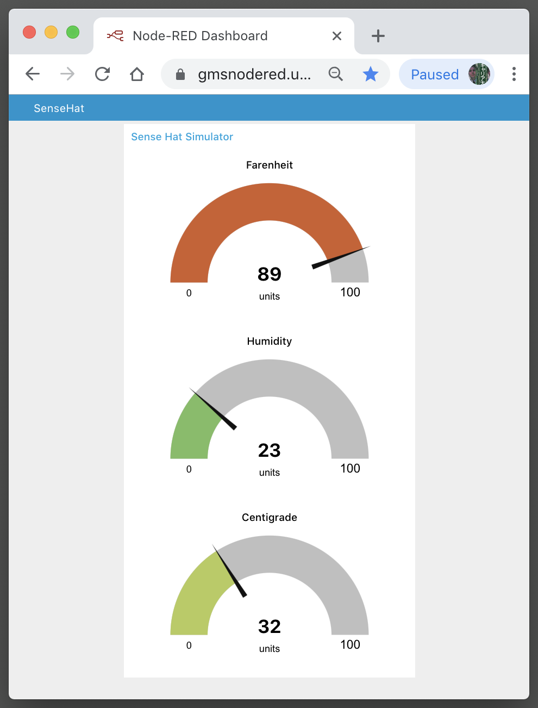
***Figure 2: Node-RED Guages indicate it's Warm indoors***
 
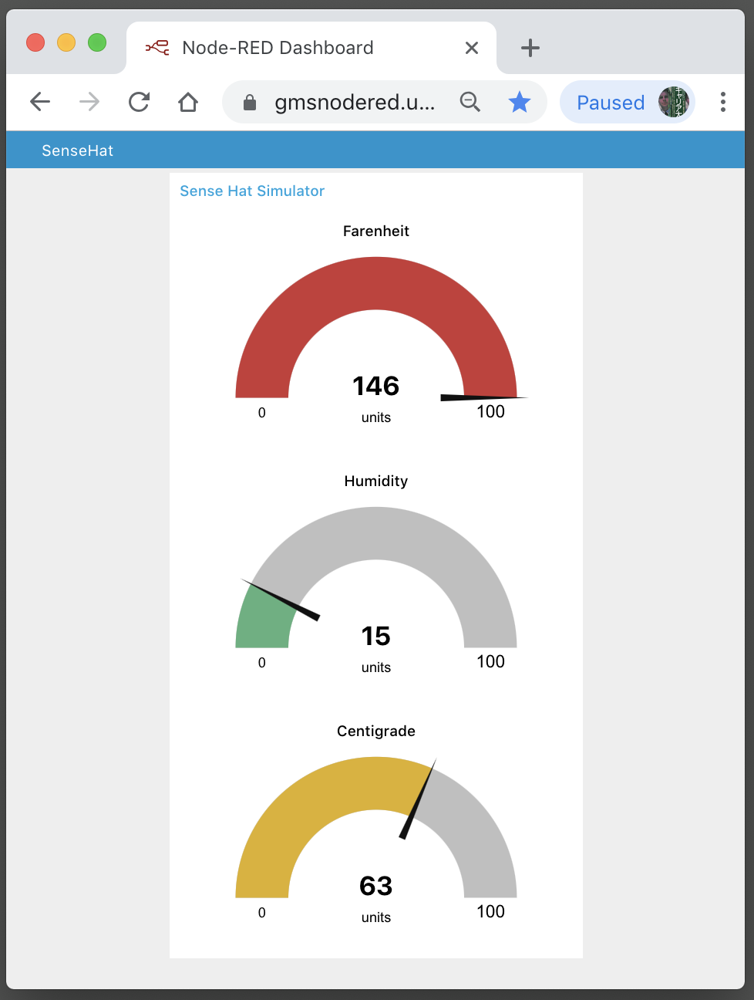
***Figure 3: Node-RED Guages indicate it's Very Hot indoors***


***Figure 4: SenseHAT mounted on Raspberry Pi 3 using plexiglass housing with brass spacers***


 


