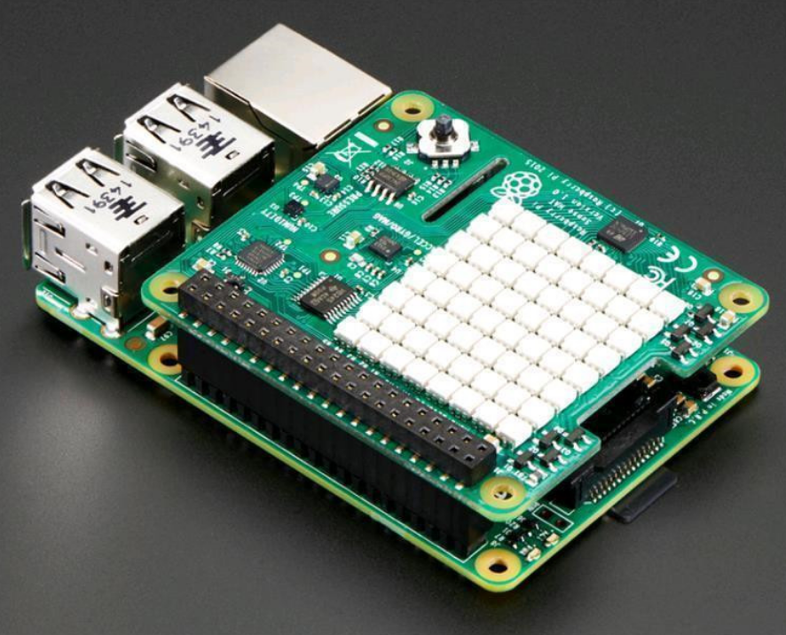

# Simple Raspberry Pi - weather reporter ( Temp and Humidity )





## pre-reqs
Raspberry Pi 2 or 3 - not sure about v4
[Sense HAT](https://www.adafruit.com/product/2738)
SSD card ( 8 or 16 Gb should be fine )

### The Sense HAT is an add-on board for the Raspberry Pi

The board allows you to make measurements of temperature, humidity, pressure, and orientation, 
and to output information using its built-in LED matrix.

We will use it to publish Temperature(Centigrade) and Humidity metrics to [Node-RED](https://nodered.org/) on the [IBM Cloud](https://cloud.ibm.com) - free account!

It will also display the Temperature(Centigrade) to the matrix screen everytime your `cron` job runs

## These instructions were run on a Raspberry Pi v3 and with the Raspbian OS 
* Setting up Raspbian on your pi is easiest with [NOOBS](https://www.raspberrypi.org/documentation/installation/noobs.md)
## setup the Sense HAT
* setting up [Sense HAT](https://projects.raspberrypi.org/en/projects/getting-started-with-the-sense-hat)

## Open or ssh into your pi, then setup a cron job as root on Raspberry Pi with a SenseHat
```sh
#become root user
sudo su
touch /home/pi/sense.log
crontab -e
# add the following line to POST updates every 5 or any interval you like, I chose 5 minutes
echo "5 * * * * /usr/bin/python /home/pi/dev/pi-hat-node-red/push.py >> /home/pi/sense.log 2>&1"
# restart cron
systemctl restart cron

exit
#revert to pi user
mkdir -p /home/pi/dev && cd /home/pi/dev

#clone repo
git clone https://github.com/Grant-Steinfeld/pi-hat-node-red.git
cd pi-hat-node-red
ls
stat push.py
echo "push.py should be here"
```

### copy the contents of Pi-SenseHat-Ingress.Node-RED.json to your clipboard and paste into your node red editor and deploy it.

### Note your hostname and update the `NODE_RED_HOST_NAME` variable in push.py with your actual hostname 


